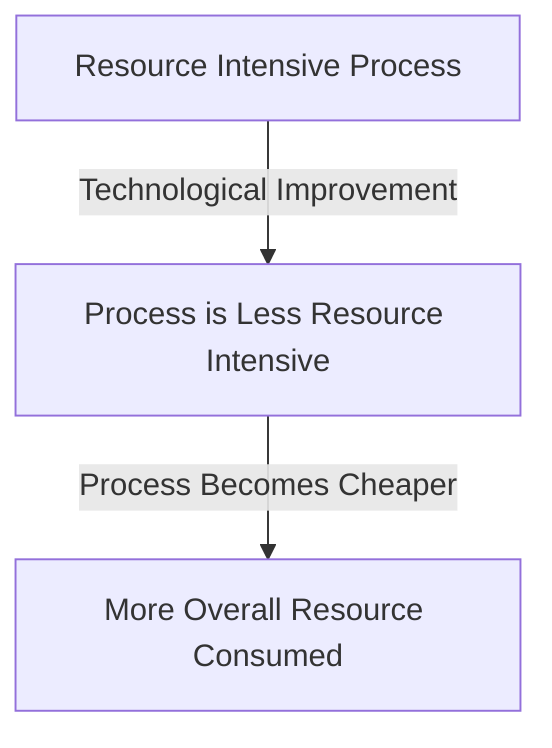

[The rebound effect](https://en.wikipedia.org/wiki/Rebound_effect_(conservation)) describes the increasing counter-intuitive rise in demand of resources following technological improvements that improve efficiency.
It was first observed by William Stanley Jevons (and so-named [the Jevons Paradox](https://en.m.wikipedia.org/wiki/Jevons_paradox)).

## Example

### Coal Usage

During the industrial revolution, efficiency in technology meant that coal-fired industrial processes became cheaper which meant that more would-be industrialists were able to partake in the revolution and start competing factories, increasing overall coal usage.

### Compute Power

As RAM and CPU time become cheaper, the amount of resources that individual programs tend to use grows - teams make assumptions like "the user likely has enough RAM for us to ship the inefficient implementation, we'll fix it later" [^meierReboundEffectJevons2022]

[^meierReboundEffectJevons2022]: Meier, E. (2022, November 10). The rebound effect (or Jevons’ paradox) in IT performance monitoring. Maltem Insight Performance. https://insight-performance.com/en/blog/2022/11/10/the-rebound-effect-or-jevons-paradox-in-it-performance-monitoring/
